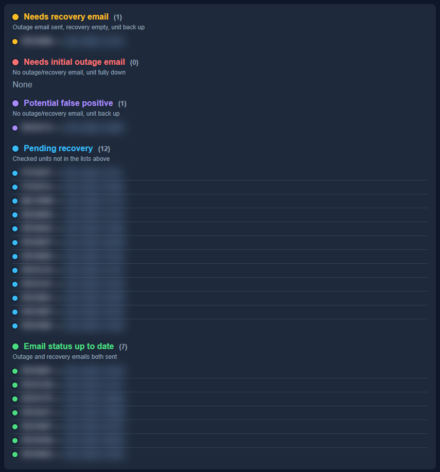

# work_tool

Internal Flask dashboard for NOC / field ops: ERP outage verification, unit health checks, camera launch, router/switch tools, and related helpers.

Screenshots below were taken from a live local instance. **Sensitive ticket text, unit IDs, customer/site names, and stdout are blurred.** Menu labels and chrome are left readable on purpose.

> **ERP writes are disabled by default** (`DISABLE_ERP_WRITES=1`). Mutating actions stay visible but inactive (Set Fields, Create Project, Terminate/Activate Site, Clear MU, Tech Checks, Add Missing Components). **Resolve (R)** is local-only and stays enabled. Set `DISABLE_ERP_WRITES=0` only when you intentionally need writes. Open / Validate / Ping / Snapshot / cameras remain read-oriented.

---

## Setup (coworkers)

1. Get access to the **private** GitHub repo.
2. Clone the repo.
3. Copy `.env.example` → `.env` and fill in credentials.
4. **Never commit** `.env`, `net_sheet.csv`, `uploads/`, or exported CSVs.
5. Install Python packages used by `flask_endpoints.py` / `work_tool.py` (and `Pillow` only if regenerating docs screenshots).
6. Copy a local `net_sheet.csv` from an existing install (gitignored).
7. Optionally set `SENTRA_NETWORK_TOOL_V19_DIR` to your v19 tool folder.

```bat
run_live.bat      rem http://127.0.0.1:5000 — daily use
run_sandbox.bat   rem http://127.0.0.1:5001 — dev/test (auto-reload)
```

| Script | URL | Purpose |
|--------|-----|---------|
| `run_live.bat` | http://127.0.0.1:5000 | Production dashboard |
| `run_sandbox.bat` | http://127.0.0.1:5001 | Dev/test (own `data/sandbox/`) |

With `PAUSE_AUTOMATED_TASKS=1` (default on both bats), scheduled 4:00/4:05/4:10 jobs and 30‑minute ERP polling stay off. Manual **Pull Issues**, validate, Open menus, etc. still work.

With `DISABLE_ERP_WRITES=1` (default when unset), ERP-mutating actions (Set Fields, Create Project, Terminate/Activate Site, Clear MU, Tech Checks, Add Missing Components) stay visible but disabled; matching POST routes return 403. **Resolve (R)** is local-only and stays enabled. Set `DISABLE_ERP_WRITES=0` to allow writes.

---

## 1. Issues Dashboard (home)

Open **http://127.0.0.1:5000/** — the Issues Dashboard is the home page (navbar + ticket lists + stdout).


**Navbar:** **Issues Dashboard** (home) · **Recovery Email Check** (`/recovery_email`)

### Moved URLs

These old entry points show a short “page moved” screen and auto-redirect to `/`:

| Old URL | Former tool |
|---------|-------------|
| `/issues` | Unit Outage Verification landing |
| `/issues/watch` | Issues watch report |
| `/victron` | Victron VRM Checker |
| `/outage_filter` | Outage Filter |
| `/linux` | Linux Diagnostic Tool |
| `/zabbix` | Zabbix Monitor |

API-style routes under `/issues/...` (validate, cameras, ping, etc.) are unchanged.

### Layout

- **Left — Stdout:** Live validation / ping / carrier / SSH-style logs. Search + Clear.
- **Right — Lists:** Tickets grouped by category. Filter search, **All lists / One list**, **Pull Issues**, **Clear checkboxes**.
- **Header counters:** Resolved today / Worked / Skipped (local workflow tracking).
- **Per-row LEDs:** Green / yellow / orange / red compute (and speaker/camera LEDs where relevant).
- **R / W / S:** Resolved / Worked / Skipped checkboxes (local UI state only; Resolve does not post to ERP).

### Issue list categories

| List | Meaning |
|------|---------|
| **Up Steady** | Validated reachable / false positive path |
| **Offline compute** | NUC / compute side soft-down |
| **Scrypted outage** | Scrypted path issues |
| **Speaker outage** | Speaker tickets |
| **Camera outage** | Camera tickets |
| **Down Full** | Fully down (includes former stale-VPN range behavior) |
| **Panel issues** | Panel / fisheye panel tickets |
| **Camera View** | Router + compute reachability view |
| **On Hold** | Held tickets (with hold kind) |
| **Monitoring Hours / Termination / Relocation** | Specialty buckets |

Each list (except a few write-heavy specialty buckets) has **Revalidate** to re-check tickets in that list only.

### Projects panel

Switch the toolbar dropdown from **Issues** → **Projects**.


Shows ERP-ish project buckets such as **Open**, **In Progress**, and **Deployment Prep**, with the same unit command menus and connectivity LEDs. **Pull Projects** refreshes project data (read). Task Controls that write stay visible but disabled when `DISABLE_ERP_WRITES=1` (default).

### Same unit on multiple tickets

If a unit appears more than once (e.g. three tickets), **Validate (Quick/Full)** updates the **status LED on every occurrence** of that unit across lists. Tickets are not auto-moved just because a sibling was validated.

### Unit search / Unit tools

Type a unit into the list filter even if it is not on the current report. Matching tickets filter in place; with no ticket match you get an ad-hoc **Unit tools** row for the same command menus.

---

## 2. Per-unit command menu

Click the unit button (left of the LED) to open **Commands**.


### Validate

| Action | Behavior |
|--------|----------|
| **Validate (Quick)** | Category / connectivity re-check (`/issues/validate-unit/...`). On NUC-down lists may ping compute only. |
| **Validate (Full)** | Deeper multi-endpoint check (`/issues/validate-unit-full/...`) → LED colors (green/yellow/orange/red), optional list move. |

LED colors (compute):

- **Green** — up / steady  
- **Yellow** — soft down / still unreachable compute or Scrypted  
- **Orange** — multi-down  
- **Red** — fully down  

### Router

- **Get Carrier** — SIM ICCID → carrier via v19 inventory  
- **Quick Validate** — router-oriented check  
- **Ping Router** / **Long Ping Router** — ICMP (long ping streams to stdout)

### Cameras

- **Fisheye Snapshot** — grab snapshot into the UI  
- **Open All Cameras** — multi-tile launch page  
- **Open Camera N / Open Fisheye** — single camera (when netsheet has IPs)

### Open (external / proxied UIs)

In-app **Open** menu with **Shield** and **ERP** expanded. Button labels are unblurred; ticket/unit context elsewhere on the page is blurred.


**Shield** (opens `shield.{workTLD}` in a new tab — may require login):


| Button | Opens |
|--------|--------|
| **Open Site** | Shield site page for the ticket’s site ID |
| **Open RD Component** | Shield component `SC-{unit}` (RD/FD/MU as applicable) |
| **Open Trailer Component** | Attached MU/trailer component, or disabled when none (e.g. ACRD) |

**ERP** (opens `erp.{workTLD}` — may require login):


| Button | Opens |
|--------|--------|
| **Open Event Records** | ERP event-record list filtered to the unit |
| **Open Site Page** | ERP site page |
| **Open RD Component** | ERP component `SC-{unit}` |
| **Open Trailer Component** | Attached trailer/MU component when present |

**Also under Open**

- Open Mesh  
- Open Raindance  
- Open Switch (digest/basic redirect when IP known)  
- Open PVE  
- Open Platform  
- Open Relay (3100+)  
- Open Scrypted  
- Open VRM  

These open browser tabs / redirects. They do **not** write ERP fields by themselves. Destination Shield/ERP pages are behind company auth; docs show the in-app Open buttons rather than live destination pages.

### Switch

- Bounce ports / uptime / log helpers when switch IP exists (see menu items on a unit with a switch).

### Linux / NUC (when unit supports them)

- **NUC:** reboot, uptime, chkdsk (read-only), Check Patch Version  
- **Linux → Scrypted:** Set No Audio, Reboot Scrypted / Reboot PVE (destructive — use carefully; not ERP writes, but they reboot gear)

### Disabled ERP Write Functions

With `DISABLE_ERP_WRITES=1` (default), these stay **visible but disabled** in the UI, and matching POST routes return 403:

- **Set Fields** (ERP field writes)  
- **Create Deployment / Termination / Relocation / Refurbish** projects  
- **Terminate Site** / **Activate Site**  
- **Clear MU Coordinates** / **Clear MU Site**  
- **Tech Checks (180 Unit)** confirm  
- **Add Missing Components** (manual and scheduled)

**Resolve (R)** is local-only and is **not** blocked by this flag. Set `DISABLE_ERP_WRITES=0` in `.env` to re-enable the write actions above.

**Note:** **Update Patch Version** is separate from this gate (not an ERP ticket write); treat it carefully when enabled.

---

## 3. Camera launch grid

From **Cameras → Open All Cameras** (or `/issues/cameras-launch/<UNIT>`).


- Grid of proxied camera UIs (Dahua H5 / Hikvision with shim).  
- Controls: **Columns**, **Zoom**, **Height**, **IE mode**, **Reload all**, **Open all in tabs**.  
- Per tile: Log out / Reload / Open tab.  
- ACRD / unit rules decide which cameras appear (e.g. fisheye + C1–C3, no C4 when no MU).  
- Live/PTZ/Smart Event drawing depends on vendor; Hikvision ActiveX needs Edge IE mode via **Open tab** / IE mode workflows.

---

## 4. Recovery Email Check

From the Issues Dashboard navbar → **Recovery Email Check** (`/recovery_email`).

Upload the latest Shield NOC outage spreadsheet (`.xlsx` / `.csv`) → **Check Recovery Emails**.

### Results dashboard

Lists use **status lights** (same LED language as Issues) next to each list name and ticket row. Ticket units/IDs are blurred in docs screenshots; **list names and LEDs stay visible**.




| List | LED | Meaning |
|------|-----|---------|
| **Needs recovery email** | Yellow | Outage email sent, recovery empty, unit back up |
| **Needs initial outage email** | Red | No outage/recovery email, unit fully down |
| **Potential false positive** | Purple | No outage/recovery email, unit back up |
| **Pending recovery** | Blue | Checked units not in the lists above |
| **Email status up to date** | Green | Outage and recovery emails both sent |

Example run (ART spreadsheet): recovery (1), initial (0), false positive (1), pending (12), up to date (7).

### Per-unit command menus

Each unit row has the same style of **unit command button** as the Issues Dashboard:

| Menu | Actions |
|------|---------|
| **Validate** | Quick / Full (writes to stdout on this page) |
| **Cameras** | Fisheye snapshot, Open All, individual cameras |
| **Open** | Shield, ERP, Mesh, Raindance, Switch, PVE / Relay / Platform / Scrypted when available, VRM for RD units |

Ticket subject from the spreadsheet is carried into the menu so Shield/ERP/VRM resolve more accurately. ERP write actions are not offered on this page.

---

## Environment variables (summary)

See `.env.example` for the full list. Common ones:

| Variable | Purpose |
|----------|---------|
| `erp_token` | ERP API |
| `victron_token` / `idUser` | Victron VRM |
| `workTLD` | Domain for ERP / Shield / Scrypted URLs |
| `fishuser` / `fishpass` | Camera / relay auth |
| `switchuser` / `switchpass` | Switch UI |
| `nucuser` / `nucpass` | NUC SSH |
| `pveuser` / `pvepass` / `pvesshuser` | PVE web + SSH |
| `scryptuserweb` / `scryptuserssh` / `scryptpass` | Scrypted |
| `MESH_BASE_URL` / `RAINDANCE_BASE_URL` | Optional Open menu bases |
| `SENTRA_NETWORK_TOOL_V19_DIR` | Path to `Sentra_Network_toolv19` |
| `PAUSE_AUTOMATED_TASKS` | `1` pauses schedulers / auto poll |
| `DISABLE_ERP_WRITES` | `1` (default) leaves ERP write buttons visible but disabled; POST routes return 403. Set `0` to allow writes. Resolve (R) is local-only and stays enabled. |
| `WORK_TOOL_ENV` / `WORK_TOOL_PORT` | live vs sandbox |

---

## Secrets policy

- Commit `.env.example` and blurred docs screenshots only.  
- Do not commit `.env`, netsheets, uploads, or raw unblurred ops screenshots.  
- Rotate any token that ever appeared in an older git history of a different clone.

---

## Regenerating screenshots

Screenshots live in `docs/screenshots/`. They were captured with the Cursor browser tools against a local `:5000` instance (gowitness is optional; not required).

**Issues Dashboard blur rules**

- Blur ticket subject / unit link text (`.ticket-label > a`), unit command-button labels, stdout, and counters.
- **Leave readable:** status LEDs, issue type / subtype meta (`.meta`), **UNDIAGNOSED** (`.undiagnosed-badge`), **(New!)** (`.new-ticket-badge`), and menu chrome labels.
- Do **not** press ERP write confirmations.
- Document Open → Shield / ERP with the in-app button crops only (do not capture live Shield/ERP destination pages).
