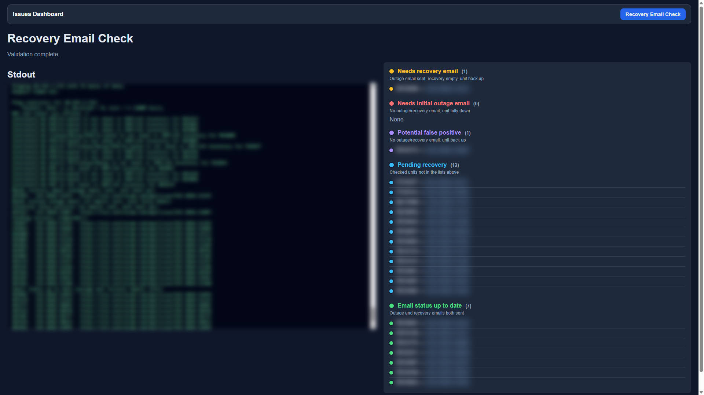

# work_tool

Internal Flask dashboard for NOC / field ops: ERP outage verification, unit health checks, camera launch, router/switch tools, and related helpers.

Screenshots below were taken from a live local instance.

> **ERP writes are disabled by default** (`DISABLE_ERP_WRITES=1`). Mutating actions stay visible but inactive (Set Fields, Create Project, Terminate/Activate Site, Clear MU, Tech Checks, Add Missing Components). **Resolve (R)** is local-only and stays enabled. Set `DISABLE_ERP_WRITES=0` only when you intentionally need writes. Open / Validate / Ping / Snapshot / cameras remain read-oriented.

---

## Setup (coworkers)

1. Get access to the **private** GitHub repo.
2. Clone the repo.
3. Copy `.env.example` → `.env` and fill in credentials.
4. **Never commit** `.env`, `net_sheet.csv`, `uploads/`, or exported CSVs.
5. Install Python packages used by `flask_endpoints.py` / `work_tool.py`.
6. Copy a local `net_sheet.csv` from an existing install (gitignored).
7. Optionally set `SENTRA_NETWORK_TOOL_V19_DIR` to your v19 tool folder.

```bat
run_live.bat      rem http://127.0.0.1:5000 — daily use
run_sandbox.bat   rem http://127.0.0.1:5001 — dev/test (auto-reload)
```

| Script | URL | Purpose |
|--------|-----|---------|
| `run_live.bat` | http://127.0.0.1:5000 | Production dashboard |
| `run_sandbox.bat` | http://127.0.0.1:5001 | Dev/test (own `data/sandbox/`) |

With `PAUSE_AUTOMATED_TASKS=1` (default on both bats), scheduled 4:00/4:05/4:10 jobs and 30‑minute ERP polling stay off. Manual **Pull Issues**, validate, Open menus, etc. still work.

With `DISABLE_ERP_WRITES=1` (default when unset), ERP-mutating actions (Set Fields, Create Project, Terminate/Activate Site, Clear MU, Tech Checks, Add Missing Components) stay visible but disabled; matching POST routes return 403. **Resolve (R)** is local-only and stays enabled. Set `DISABLE_ERP_WRITES=0` to allow writes.

---

## 1. Issues Dashboard (home)

Open **http://127.0.0.1:5000/** — the Issues Dashboard is the home page (navbar + ticket lists + stdout).


**Navbar:** **Issues Dashboard** (home) · **Recovery Email Check** (`/recovery_email`)

### Layout

- **Left — Stdout:** Live validation / ping / carrier / SSH-style logs. Search + Clear.
- **Right — Lists:** Tickets grouped by category. Filter search, **All lists / One list**, **Pull Issues**, **Clear checkboxes**.
- **Header counters:** Resolved today / Worked / Skipped (local workflow tracking).
- **Per-row LEDs:** Green / yellow / orange / red compute (and speaker/camera LEDs where relevant).
- **Weather icons:** Between the LED and the ticket link. Metro weather from the subject region code (`LAX` / `OAK` / `HOU` / `PHX` / `SLC` / `DEN`) via Open-Meteo — **no ERP**. Fresh fetch on page load; auto-refresh every **30 minutes**. Distinct icons for clear / partly cloudy / mostly cloudy / rain / thunder / etc. **Click an icon** (or **Weather → Weather (Current)**) for precise site/trailer weather → stdout + icon update. Toolbar **Update Weather** force-refreshes all region icons.
- **R / W / S:** Resolved / Worked / Skipped checkboxes (local UI state only; Resolve does not post to ERP).

### Issue list categories

| List | Meaning |
|------|---------|
| **Up Steady** | Validated reachable / false positive path |
| **Offline compute** | NUC / compute side soft-down |
| **Scrypted outage** | Scrypted path issues |
| **Speaker outage** | Speaker tickets |
| **Camera outage** | Camera tickets |
| **Down Full** | Fully down (includes former stale-VPN range behavior) |
| **Panel issues** | Panel / fisheye panel tickets |
| **Camera View** | Router + compute reachability view |
| **On Hold** | Held tickets (with hold kind) |
| **Monitoring Hours / Termination / Relocation** | Specialty buckets |

Each list (except a few write-heavy specialty buckets) has **Revalidate** to re-check tickets in that list only.

### Projects panel

Switch the toolbar dropdown from **Issues** → **Projects**.


Shows ERP-ish project buckets such as **Open**, **In Progress**, and **Deployment Prep**, with the same unit command menus and connectivity LEDs. **Pull Projects** refreshes project data (read). Task Controls that write stay visible but disabled when `DISABLE_ERP_WRITES=1` (default).

### Unit search / Unit tools

Type a unit into the list filter even if it is not on the current report. Matching tickets filter in place; with no ticket match you get an ad-hoc **Unit tools** row for the same command menus.

---

## 2. Per-unit command menu

Click the unit button (left of the LED) to open **Commands**.


### Validate

| Action | Behavior |
|--------|----------|
| **Validate (Quick)** | Category / connectivity re-check (`/issues/validate-unit/...`). On NUC-down lists may ping compute only. |
| **Validate (Full)** | Deeper multi-endpoint check (`/issues/validate-unit-full/...`) → LED colors (green/yellow/orange/red), optional list move. |

LED colors (compute):

- **Green** — up / steady  
- **Yellow** — soft down / still unreachable compute or Scrypted  
- **Orange** — multi-down  
- **Red** — fully down  

### Weather

Top-level **Weather** submenu on the unit command menu:

- **Weather (Current)** — site address GPS (ERP Site), else trailer (MU) coordinates → Open-Meteo → stdout + icon update. Same as clicking the weather icon.
- **Weather (History)** — opens timeanddate historic weather for the subject region city (`PHX`→phoenix, `DEN`→denver, `LAX`→los-angeles, `OAK`→oakland, `HOU`→houston, `SLC`→salt-lake-city).

Region list icons stay metro-level and ERP-free; **Weather (Current)** / icon click is the precise site/trailer path.

### Router

- **Get Carrier** — SIM ICCID → carrier via v19 inventory  
- **Quick Validate** — router-oriented check  
- **Ping Router** / **Long Ping Router** — ICMP (long ping streams to stdout)

### Cameras

- **Fisheye Snapshot** — grab snapshot into the UI  
- **Open All Cameras** — multi-tile launch page  
- **Open Camera N / Open Fisheye** — single camera (when netsheet has IPs)

### Open (external / proxied UIs)

In-app **Open** menu with **Shield** and **ERP** expanded.


**Shield** (opens `shield.{workTLD}` in a new tab — may require login):


| Button | Opens |
|--------|--------|
| **Open Site** | Shield site page for the ticket’s site ID |
| **Open RD Component** | Shield component `SC-{unit}` (RD/FD/MU as applicable) |
| **Open Trailer Component** | Attached MU/trailer component, or disabled when none (e.g. ACRD) |

**ERP** (opens `erp.{workTLD}` — may require login):


| Button | Opens |
|--------|--------|
| **Open Event Records** | ERP event-record list filtered to the unit |
| **Open Site Page** | ERP site page |
| **Open RD Component** | ERP component `SC-{unit}` |
| **Open Trailer Component** | Attached trailer/MU component when present |

**Also under Open**

- Open Mesh  
- Open Raindance  
- Open Switch (digest/basic redirect when IP known)  
- Open PVE  
- Open Platform  
- Open Relay (3100+)  
- Open Scrypted  
- Open VRM  

These open browser tabs / redirects. They do **not** write ERP fields by themselves. Destination Shield/ERP pages are behind company auth; docs show the in-app Open buttons rather than live destination pages.

### Switch

- Bounce ports / uptime / log helpers when switch IP exists (see menu items on a unit with a switch).

### Linux / NUC (when unit supports them)

- **NUC:** reboot, uptime, chkdsk (read-only)  
- **Linux → Scrypted:** Set No Audio, Reboot Scrypted / Reboot PVE, Check Patch Version, Update Patch Version

### Disabled ERP Write Functions

With `DISABLE_ERP_WRITES=1` (default), these stay **visible but disabled** in the UI, and matching POST routes return 403:

- **Set Fields** (ERP field writes)  
- **Create Deployment / Termination / Relocation / Refurbish** projects  
- **Terminate Site** / **Activate Site**  
- **Clear MU Coordinates** / **Clear MU Site**  
- **Tech Checks (180 Unit)** confirm  
- **Add Missing Components** (manual and scheduled)

**Resolve (R)** is local-only and is **not** blocked by this flag. Set `DISABLE_ERP_WRITES=0` in `.env` to re-enable the write actions above.

**Note:** **Update Patch Version** is separate from this gate (not an ERP ticket write); treat it carefully when enabled.

---

## 3. Camera launch grid

From **Cameras → Open All Cameras** (or `/issues/cameras-launch/<UNIT>`).


- Grid of proxied camera UIs (Dahua H5 / Hikvision with shim).  
- Controls: **Columns**, **Zoom**, **Height**, **IE mode**, **Reload all**, **Open all in tabs**.  
- Per tile: Log out / Reload / Open tab.  
- ACRD / unit rules decide which cameras appear (e.g. fisheye + C1–C3, no C4 when no MU).  
- Live/PTZ/Smart Event drawing depends on vendor; Hikvision ActiveX needs Edge IE mode via **Open tab** / IE mode workflows.

---

## 4. Recovery Email Check

From the Issues Dashboard navbar → **Recovery Email Check** (`/recovery_email`).

The live service pulls ART report **153** (*Shield: NOC: Outage Issues with no initial email*) about once an hour (htmlDataTable → local `.xlsx`; native ART xlsx export fails server-side). Uses `myemail` / `mypass` from `.env`. Honors `PAUSE_AUTOMATED_TASKS`.

On the page:

- **Check cached ART report** — run against the last hourly download
- **Download from ART & Check** — refresh now, then run
- Optional manual `.xlsx` / `.csv` upload

### Results dashboard

Lists use **status lights** (same LED language as Issues) next to each list name and ticket row.

**Search (same idea as Issues Dashboard):**

- **Stdout:** search box + Clear above the console (filters / highlights matching lines).
- **Lists:** filter box above the result lists (unit / subject / ticket id); empty lists hide while filtering.
- **Worked checkboxes:** local-only (browser storage). Mark tickets you’ve handled; **Clear worked** resets them. Does not write to ERP.



| List | LED | Meaning |
|------|-----|---------|
| **Needs recovery email** | Yellow | Outage email sent, recovery empty, unit back up |
| **Needs initial outage email** | Red | No outage/recovery email, unit fully down |
| **Potential false positive** | Purple | No outage/recovery email, unit back up |
| **Pending recovery** | Blue | Checked units not in the lists above |
| **Email status up to date** | Green | Outage and recovery emails both sent |

Example run (ART spreadsheet): recovery (1), initial (0), false positive (1), pending (12), up to date (7).

### Per-unit command menus

Each unit row has the same style of **unit command button** as the Issues Dashboard:

| Menu | Actions |
|------|---------|
| **Validate** | Quick / Full (writes to stdout on this page) |
| **Cameras** | Fisheye snapshot, Open All, individual cameras |
| **Open** | Shield, ERP, Mesh, Raindance, Switch, PVE / Relay / Platform / Scrypted when available, VRM for RD units |

Ticket subject from the spreadsheet is carried into the menu so Shield/ERP/VRM resolve more accurately. ERP write actions are not offered on this page.

---

## API Endpoints & Route Documentation

All HTTP routes are defined in `flask_endpoints.py` (there is no separate `app.py`). Base URL examples use the live instance: `http://127.0.0.1:5000`.

### Conventions

| Item | Behavior |
|------|----------|
| JSON errors | Usually `{"ok": false, "error": "<message>"}` with `400` / `403` / `404` / `409` / `502` |
| ERP write guard | When `DISABLE_ERP_WRITES=1` (default), mutating POSTs return **403** with `{"ok": false, "error": "ERP writes are disabled (set DISABLE_ERP_WRITES=0 in .env to enable)."}` |
| Automation pause | `PAUSE_AUTOMATED_TASKS=1` / sandbox skips background ERP poll unless `force` + `manual` |
| Shared job id | Issues Dashboard uses job id `"shared"` |
| SSE | `Content-Type: text/event-stream` — lines like `data: {"type":"log","line":"..."}\n\n` |

---

### Pages & legacy redirects

#### `GET /`

**Description:** Issues Dashboard home. Starts the shared validation job if needed.

**Request:** None.

**Response:**
- `200` — HTML (`issues_results.html`) with `job_id`, `work_tld`, `mesh_base_url`, `raindance_base_url`, `automation_paused`, `erp_writes_disabled`

#### `GET /victron` · `GET|POST /victron/results`

**Description:** Retired Victron UI — shows “page moved”.

**Request:** None.

**Response:** `200` — HTML (`page_moved.html`)

#### `GET /outage_filter` · `GET|POST /outage_filter/results`

**Description:** Retired Outage Filter — shows “page moved”.

**Request:** None.

**Response:** `200` — HTML (`page_moved.html`)

#### `GET /linux` · `GET|POST /linux/results` · `GET /linux/watch/<job_id>` · `GET /linux/stream/<job_id>`

**Description:** Retired Linux diagnostic tool — shows “page moved”.

**Request:** Path `job_id` where present.

**Response:** `200` — HTML (`page_moved.html`)

#### `GET /zabbix`

**Description:** Retired Zabbix UI — shows “page moved”.

**Request:** None.

**Response:** `200` — HTML (`page_moved.html`)

#### `GET /issues`

**Description:** Legacy issues entry — shows “page moved”.

**Request:** None.

**Response:** `200` — HTML (`page_moved.html`)

#### `POST /issues/results`

**Description:** Ensures the shared issues job exists, then redirects to home.

**Request:** None (body ignored).

**Response:** `302` → `/`

#### `GET /issues/watch`

**Description:** Legacy shared watch URL — shows “page moved”.

**Request:** None.

**Response:** `200` — HTML (`page_moved.html`)

#### `GET /issues/watch/<job_id>`

**Description:** Issues Dashboard for a specific stream job.

**Request:** Path `job_id`.

**Response:**
- `200` — HTML (`issues_results.html`)
- `404` — plain text `Unknown job`

---

### Issues job streaming & state

#### `GET /issues/stream/<job_id>`

**Description:** Server-Sent Events stream of validation logs, progress, and completion for a job.

**Request:** Path `job_id`.

**Response:**
- `200` — `text/event-stream`
```json
{"type": "log", "line": "Validating RD1234..."}
{"type": "progress", "current": 3, "total": 40, "unit": "RD1234"}
{"type": "done", "results": { "false_positives": [], "truly_down": [] }}
```
- `404` — plain text `Unknown job`

#### `GET /issues/state/<job_id>`

**Description:** Cursor-based event history and optional results snapshot for dashboard sync / reconnect.

**Request:**
- Path: `job_id`
- Query: `cursor` (int, default `0`), `version` (int, default `0`)

**Response:**
- `200`
```json
{
  "ok": true,
  "events": [],
  "cursor": 12,
  "done": true,
  "version": 3,
  "validation_run_id": "abc",
  "results": null,
  "resolved_today": { "date": "2026-09-08", "count": 2, "issue_ids": ["ISS-1", "ISS-2"] }
}
```
(`results` is a full copy only when the client `version` differs from the job version; otherwise `null`.)
- `400` — `{"ok": false, "error": "Invalid state cursor"}`
- `404` — `{"ok": false, "error": "Unknown job"}`

#### `POST /issues/poll/<job_id>`

**Description:** Incremental ERP refresh for Open/Monitoring/On Hold issues or Open/In Progress projects on a finished job.

**Request body (JSON):**
```json
{ "force": true, "manual": true, "scope": "issues" }
```
| Field | Type | Notes |
|-------|------|-------|
| `force` | bool | Bypass ~30‑minute throttle |
| `manual` | bool | With `force`, also bypasses `PAUSE_AUTOMATED_TASKS` |
| `scope` | string | `issues` (default) or `projects` |

**Response:**
- `200` success — includes `ok`, `scope`, `new_count`, `removed_count`, `restored_count`, `updated_count`, `project_count`, `results`, `logs`, `resolved_today` (issues may include `fetched_count` / `snapshot`)
- `200` skipped / paused / busy — `ok: true` with `skipped` / `paused` / `busy` and zero counts
- `404` — unknown job
- `409` — initial validation still running
- `502` — `{"ok": false, "scope": "issues", "error": "...", "logs": []}`

#### `GET /issues/resolved`

**Description:** Today’s local resolved-ticket tracker (browser/UI workflow; not an ERP write).

**Request:** None.

**Response:** `200`
```json
{ "ok": true, "date": "2026-09-08", "count": 2, "issue_ids": ["ISS-1", "ISS-2"] }
```

#### `POST /issues/resolved`

**Description:** Mark an issue resolved locally and remove it from shared-job lists.

**Request body (JSON):**
```json
{ "issue_id": "ISS-123" }
```

**Response:**
- `200` — `{ "ok": true, "added": true, "date": "...", "count": 3, "issue_ids": [...] }`
- `400` — missing `issue_id`

---

### Cameras & device UI

#### `GET /issues/cameras/<unit>`

**Description:** List configured cameras for a unit (from netsheet).

**Request:** Path `unit` (e.g. `RD3076`).

**Response:**
- `200` — `{"ok": true, "unit": "RD3076", "cameras": [{"target": "camera1", "label": "Camera 1", ...}]}`
- `404` — `{"ok": false, "error": "..."}`

#### `GET /issues/cameras-launch/<unit>`

**Description:** Multi-camera iframe launcher (proxied Dahua/Hikvision grid).

**Request:** Path `unit`.

**Response:**
- `200` — HTML (`camera_launch.html`)
- `404` — same template with error context

#### `POST /issues/open-camera-urls`

**Description:** Open camera URLs in browser tabs (optional IE mode on the client/server path).

**Request body (JSON):**
```json
{ "urls": ["http://10.191.4.182:11000/"], "ie_mode": true }
```

**Response:**
- `200` — `{"ok": true, "ie_mode": true, "opened": 1, "urls": [...], ...}`
- `400` — `{"ok": false, "error": "..."}`

#### `GET /issues/camera-snapshot/<unit>/<target>`

**Description:** Authenticated JPEG snapshot via camera proxy.

**Request:** Path `unit`, `target` (`fisheye` / `camera1`–`camera4`).

**Response:**
- `200` — `image/jpeg` (`Cache-Control: no-store`)
- `502` — plain-text error

#### `GET /issues/camera/<unit>/<target>`

**Description:** Redirect helper page into the camera login/proxy flow.

**Request:** Path `unit`, `target`.

**Response:**
- `200` — HTML (`camera_redirect.html`)
- `404` — plain-text error

#### `GET|POST|PUT|DELETE|PATCH|HEAD|OPTIONS /issues/camera-proxy/<unit>/<target>/`  
#### `GET|POST|PUT|DELETE|PATCH|HEAD|OPTIONS /issues/camera-proxy/<unit>/<target>/<path:subpath>`

**Description:** HTTP reverse proxy to a unit camera (Digest/Basic auth, HTML shim injection). Live WebSockets go direct to the camera, not through Flask.

**Request:** Path `unit`, `target`, optional `subpath`; query string, headers (minus `Host`), and body are forwarded.

**Response:** Upstream status/headers/body (HEAD returns empty body). Proxy failure → plain text `502`.

#### `404` handler — `camera_proxy_root_fallback`

**Description:** If a camera UI requests a root-relative asset (`/module/...`) and the `Referer` is a camera-proxy page, redirect into that camera’s proxy prefix.

**Response:** `302` to `/issues/camera-proxy/<unit>/<target><path>` when applicable; otherwise the normal 404.

#### `GET /issues/fisheye/<unit>`

**Description:** Fisheye JPEG snapshot for the unit.

**Request:** Path `unit`.

**Response:** `200` `image/jpeg`, or plain-text `502`.

#### `GET /issues/switch/<unit>`

**Description:** Switch UI redirect page.

**Request:** Path `unit`.

**Response:** `200` HTML (`switch_redirect.html`), or plain-text `502`.

#### `GET /issues/relay/<unit>`

**Description:** Relay UI redirect page.

**Request:** Path `unit`.

**Response:** `200` HTML (`relay_redirect.html`), or plain-text `502`.

#### `GET /issues/pve/<unit>`

**Description:** Start local PVE proxy and redirect to it.

**Request:** Path `unit`.

**Response:** `302` to proxy URL, or plain-text `502`.

---

### Shield / ERP / Raindance link helpers

#### `GET /issues/shield/<unit>`

**Description:** Resolve and redirect to the Shield site page for the unit.

**Request:** Path `unit`; query `subject` (optional, improves site match).

**Response:** `302` Shield URL; `404` if site cannot be resolved; `502` if `workTLD` missing.

#### `GET /issues/shield-component/<unit>`

**Description:** Redirect to the Shield component page for the unit.

**Request:** Path `unit`.

**Response:** `302`, or `404` (`Unit or workTLD is missing`).

#### `GET /issues/attached-mu/<unit>`

**Description:** Resolve attached MU (trailer) for an RD unit.

**Request:** Path `unit`; query `subject` (optional).

**Response:** `200`
```json
{ "unit": "RD3076", "mu": "MU1234", "url": "https://..." }
```

#### `GET /issues/site-page/<unit>`

**Description:** Redirect to the ERP site page for the unit.

**Request:** Path `unit`; query `subject` (optional).

**Response:** `302` ERP URL; `404` / `502` on resolve failure.

#### `GET /issues/event-records/<unit>`

**Description:** Redirect to ERP event-records for the unit.

**Request:** Path `unit`.

**Response:** `302`, or `404` if unit/`workTLD` missing.

---

### Connectivity — pings, bounce, Robofiber, long ping

#### `POST /issues/ping-speaker/<unit>`

**Description:** ICMP/reachability check for the unit speaker.

**Request:** Path `unit`; empty body.

**Response:**
- `200` — `{"ok": true, "unit": "RD3076", "speaker_up": true, "output": "..."}`
- `404` — `{"ok": false, "error": "..."}`

#### `POST /issues/ping-camera/<unit>/<target>`

**Description:** Ping a specific camera endpoint.

**Request:** Path `unit`, `target`; empty body.

**Response:**
- `200` — `{"ok": true, "unit": "...", "target": "camera1", "camera_up": true, "output": "..."}`
- `404` — `{"ok": false, "error": "..."}`

#### `POST /issues/ping-compute/<unit>`

**Description:** Ping NUC/SNUC/compute host for the unit.

**Request:** Path `unit`; empty body.

**Response:**
- `200` — `{"ok": true, "unit": "...", "label": "NUC", "compute_up": true, "output": "..."}`
- `404` — `{"ok": false, "error": "..."}`

#### `POST /issues/ping-scrypted/<unit>`

**Description:** Ping Scrypted host for the unit.

**Request:** Path `unit`; empty body.

**Response:**
- `200` — `{"ok": true, "unit": "...", "scrypted_up": true, "output": "..."}`
- `404` — `{"ok": false, "error": "..."}`

#### `POST /issues/ping-pve/<unit>`

**Description:** Ping PVE host for the unit.

**Request:** Path `unit`; empty body.

**Response:**
- `200` — `{"ok": true, "unit": "...", "pve_up": true, "output": "..."}`
- `404` — `{"ok": false, "error": "..."}`

#### `POST /issues/bounce-switch/<unit>`

**Description:** Run `bounceswitch.exe` against the unit relay IP (streaming log).

**Request:** Path `unit`; empty body.

**Response:**
- `200` — streaming `text/plain` process output
- `500` — `{"ok": false, "error": "..."}`

#### `POST /issues/bounce-speaker/<unit>`

**Description:** Run speaker reboot utility (streaming log).

**Request:** Path `unit`; empty body.

**Response:** Same pattern as bounce-switch (`text/plain` stream or `500` JSON).

#### `POST /issues/robofiber-uptime/<unit>`

**Description:** Read Robofiber/switch uptime for the unit.

**Request:** Path `unit`; empty body.

**Response:**
- `200` — `{"ok": true, "unit": "...", "ip": "...", "switch_type": "...", "uptime": "...", ...}`
- `400` — `{"ok": false, "error": "..."}`

#### `POST /issues/robofiber-logs-link/<unit>`

**Description:** Resolve Robofiber logs link for the unit.

**Request:** Path `unit`; empty body.

**Response:** `200` `{"ok": true, ...}` or `400` `{"ok": false, "error": "..."}`.

#### `POST /issues/robofiber-logs-month/<unit>`

**Description:** Fetch/open Robofiber month logs for the unit.

**Request:** Path `unit`; empty body.

**Response:** `200` `{"ok": true, ...}` or `400` `{"ok": false, "error": "..."}`.

#### `POST /issues/ping-router/<unit>`

**Description:** One-shot router ping (quick or fixed mode).

**Request:**
- Path: `unit`
- JSON or query: `mode` — `quick` (default) or `fixed`

**Response:**
- `200`
```json
{
  "ok": true,
  "unit": "RD3076",
  "ip": "10.x.x.x",
  "mode": "quick",
  "label": "Router",
  "reachable": true,
  "returncode": 0,
  "output": "..."
}
```
- `400` — `{"ok": false, "error": "..."}`

#### `POST /issues/ping-router-long/<unit>`

**Description:** Start a long-running router ping job.

**Request:** Path `unit`; empty body.

**Response:**
- `200` — `{"ok": true, "job_id": "<hex>", "unit": "...", "ip": "...", "max_seconds": 300}`
- `400` — `{"ok": false, "error": "..."}`

#### `GET /issues/ping-router-long/<job_id>/stream`

**Description:** Stream stdout from a long router ping job.

**Request:** Path `job_id`.

**Response:** `200` — streaming `text/plain`.

#### `POST /issues/ping-router-long/<job_id>/stop`

**Description:** Stop a long router ping job.

**Request:** Path `job_id`; empty body.

**Response:**
- `200` — `{"ok": true, "message": "...", ...}`
- `404` — `{"ok": false, "error": "..."}`

---

### Unit operations (carrier, weather, patch, reboot, chkdsk)

#### `POST /issues/scrypted-no-audio/<unit>`

**Description:** Diagnose/fix Scrypted “no audio” for the unit.

**Request:** Path `unit`; empty body.

**Response:** `200` `{"ok": true, ...}` or `400` `{"ok": false, "error": "..."}`.

#### `POST /issues/check-patch/<unit>`

**Description:** SSH check of Scrypted/Linux patch package date vs expected.

**Request:** Path `unit`; empty body.

**Response:**
- `200` — `{"ok": true, "unit": "...", "host": "...", "package": "...", "date": "...", "expected_date": "...", "up_to_date": true, "raw": "..."}`
- `400` — `{"ok": false, "error": "..."}`

#### `POST /issues/carrier/<unit>`

**Description:** Lookup cell carrier from v19 SIM ICCID prefix.

**Request:** Path `unit`; empty body.

**Response:**
- `200` — `{"ok": true, "unit": "...", "carrier": "Verizon", "sims": [...], ...}`
- `400` — `{"ok": false, "error": "..."}`

#### `POST /issues/weather/<unit>`

**Description:** Current weather from site GPS (ERP) with trailer MU fallback (Open-Meteo).

**Request body (JSON):**
```json
{ "subject": "PHX - RD3076 - ..." }
```
(`subject` may also be passed as a query parameter.)

**Response:**
- `200` — `{"ok": true, "unit": "...", "temperature_label": "92°F", "conditions": "Clear", "icon": "sun", "message": "...", ...}`
- `400` — `{"ok": false, "error": "..."}`

#### `POST /issues/weather-bulk`

**Description:** Metro weather for subject region codes (`LAX` / `OAK` / `HOU` / `PHX` / `SLC` / `DEN`). No ERP.

**Request body (JSON):**
```json
{ "regions": ["PHX", "DEN"], "force": true }
```

**Response:**
- `200` — `{"ok": true, "regions": { "PHX": { "temperature_label": "...", "icon": "sun", ... } }}`
- `400` — if `regions` is not a list, or Open-Meteo/tool error

#### `POST /issues/reboot-scrypted/<unit>` · `POST /issues/reboot-snuc/<unit>`

**Description:** Reboot Scrypted / SNUC (same handler; dual path).

**Request:** Path `unit`; empty body.

**Response:**
- `200` — `{"ok": true, "unit": "RD3076", "message": "Restarting"}`
- `400` — `{"ok": false, "error": "..."}`

#### `POST /issues/reboot-pve/<unit>`

**Description:** Reboot PVE host for the unit.

**Request:** Path `unit`; empty body.

**Response:** Same shape as reboot-scrypted (`200` / `400`).

#### `POST /issues/reboot-nuc/<unit>`

**Description:** Reboot Windows NUC for the unit.

**Request:** Path `unit`; empty body.

**Response:** Same shape as reboot-scrypted (`200` / `400`).

#### `POST /issues/nuc-uptime/<unit>`

**Description:** Query NUC uptime over SSH/WMI-style path.

**Request:** Path `unit`; empty body.

**Response:**
- `200` — `{"ok": true, "unit": "...", "message": "...", "output": "..."}`
- `400` — `{"ok": false, "error": "..."}`

#### `POST /issues/chkdsk/<unit>`

**Description:** Run read-only `chkdsk` on a NUC drive.

**Request body (JSON) or query:**
```json
{ "drive": "C:" }
```

**Response:**
- `200` — `{"ok": true, "unit": "...", "drive": "C:", "message": "...", "output": "..."}`
- `400` — `{"ok": false, "error": "...", "output": "..."}` (fields vary)

#### `POST /issues/update-patch/<unit>`

**Description:** SSH install/update patch package on the unit (uses `.env` command).

**Request:** Path `unit`; empty body.

**Response:**
- `200` — `{"ok": true, "unit": "...", "host": "...", "exit_code": 0, "output": "...", ...}`
- `400` — may include `error`, `output`, `stderr`, `exit_code`, `host`

#### `GET /issues/unit-context/<unit>`

**Description:** Aggregate unit context (netsheet / ERP helpers) for menus.

**Request:** Path `unit`.

**Response:** `200` tool payload with `ok: true`, or `400` `{"ok": false, "error": "..."}`.

---

### Validation & list revalidation

#### `POST /issues/validate-unit/<unit>`

**Description:** Quick per-unit connectivity validation; may update shared-job list membership.

**Request:** Path `unit`; empty body.

**Response:**
- `200` — `{"ok": true, "unit": "...", "category": "false_positives", "output": "..."}`
- `404` — `{"ok": false, "error": "..."}`

#### `POST /issues/validate-unit-full/<unit>`

**Description:** Full per-unit validation (broader endpoint checks).

**Request:** Path `unit`; empty body.

**Response:**
- `200` — `{"ok": true, "unit": "...", "category": "...", "endpoints": {...}, ...}`
- `404` — `{"ok": false, "error": "..."}`

#### `POST /issues/validate-stale-vpn/<unit>`

**Description:** Validate router/compute path used by stale-VPN style tickets.

**Request:** Path `unit`; empty body.

**Response:**
- `200` — `{"ok": true, "unit": "...", "router_up": true, "compute_up": false, "compute_label": "NUC", "status": "...", ...}`
- `404` — `{"ok": false, "error": "..."}`

#### `POST /issues/validate-camera-view/<unit>`

**Description:** Validate camera-view (router + compute) category for a unit.

**Request:** Path `unit`; empty body.

**Response:** `200` result + `ok`, or `404` `{"ok": false, "error": "..."}`.

#### `POST /issues/revalidate-list/<list_id>`

**Description:** Re-check every ticket currently in one Issues list and move rows as needed.

**Request:** Path `list_id` (e.g. `false_positives`, `truly_down`, `scrypted_outage`, …). Empty body.

**Disallowed lists:** `discarded_tickets`, `monitoring_hours`, `termination`, `relocation`.

**Response:**
- `200`
```json
{
  "ok": true,
  "list_id": "truly_down",
  "checked": 12,
  "moved": 2,
  "moves": [
    {
      "issue_id": "ISS-1",
      "unit": "RD3076",
      "camera_target": "",
      "from": "truly_down",
      "to": "false_positives",
      "fields": {}
    }
  ],
  "logs": ["..."]
}
```
- `400` — disallowed / unknown list
- `409` — shared job not ready or busy
- `500` — `{"ok": false, "error": "...", "logs": []}`

---

### ERP mutating actions (`DISABLE_ERP_WRITES`)

Unless noted, these return **403** when ERP writes are disabled.

#### `POST /issues/set-fields/<preset_id>/<issue_id>`

**Description:** Apply a Set Fields preset to an ERP issue; may move the ticket between dashboard lists.

**Request body (JSON):**
```json
{
  "unit": "RD3076",
  "subject": "PHX - RD3076 - ...",
  "source_list_id": "truly_down"
}
```

**Response:**
- `200` — `{"ok": true, "move_to_list": "nuc_down", "issue_type": "...", ...}`
- `400` — validation/tool error
- `403` — ERP writes disabled

#### `POST /issues/add-missing-components`

**Description:** Scan ERP and add missing components/sites (scheduled job counterpart).

**Request:** Empty body.

**Response:**
- `200` — `{"ok": true, "checked": 10, "updated": 2, "skipped": 8, "errors": [], ...}`
- `403` — ERP writes disabled
- `409` — not ready / busy
- `502` — tool failure

#### `POST /issues/sync-netsheet`

**Description:** Sync netsheet rows from Sentra Network Tool v19 (manual). **Not** gated by `DISABLE_ERP_WRITES`.

**Request:** Empty body.

**Response:**
- `200` — `{"ok": true, "checked": 100, "added": 1, "backfilled": 0, "unchanged": 99, "failed": 0, "errors": [], "updated_units": []}`
- `409` — shared job not ready / busy
- `502` — exception

#### `POST /issues/create-deployment-project`

**Description:** Create an NOC Deployment project from a Prep project.

**Request body (JSON):**
```json
{ "project_id": "PRJ-123", "subject": "PHX - RD3076 - Prep ..." }
```

**Response:** `200` `{"ok": true, ...}`; `400` / `403` on failure / writes disabled.

#### `POST /issues/create-termination-project`

**Description:** Create a Termination project from an issue.

**Request body (JSON):**
```json
{ "issue_id": "ISS-123", "subject": "DEN - RD3076 - Termination ..." }
```

**Response:** `200` `{"ok": true, ...}`; `400` / `403`.

#### `POST /issues/create-relocation-project`

**Description:** Create a Relocation project from an issue.

**Request body (JSON):**
```json
{ "issue_id": "ISS-123", "subject": "PHX - RD3076 - Relocation ..." }
```

**Response:** `200` `{"ok": true, ...}`; `400` / `403`.

#### `POST /issues/lookup-site`

**Description:** Resolve ERP site metadata for terminate/activate flows. **Not** write-gated.

**Request body (JSON):**
```json
{ "subject": "PHX - RD3076 - ...", "action": "terminate" }
```
`action` ∈ `terminate` | `activate`.

**Response:** `200` `{"ok": true, ...site fields...}` or `400`.

#### `POST /issues/terminate-site`

**Description:** Terminate an ERP site.

**Request body (JSON):**
```json
{ "subject": "PHX - RD3076 - ...", "site_id": "SITE-1" }
```

**Response:** `200` `{"ok": true, ...}`; `400` / `403`.

#### `POST /issues/activate-site`

**Description:** Activate an ERP site.

**Request body (JSON):**
```json
{ "subject": "PHX - RD3076 - ...", "site_id": "SITE-1" }
```

**Response:** `200` `{"ok": true, ...}`; `400` / `403`.

#### `POST /issues/clear-mu-coordinates`

**Description:** Clear MU GPS coordinates in ERP.

**Request body (JSON):**
```json
{ "subject": "...", "unit": "RD3076", "mu": "MU1234" }
```
(`subject` / `unit` / `mu` — provide what the UI has; tool resolves MU.)

**Response:** `200` `{"ok": true, ...}`; `400` / `403`.

#### `POST /issues/clear-mu-site`

**Description:** Clear MU↔site link in ERP.

**Request body (JSON):** Same shape as clear-mu-coordinates.

**Response:** `200` `{"ok": true, ...}`; `400` / `403`.

#### `POST /issues/refurbish-projects/preview`

**Description:** Preview Refurbish project specs from a Termination subject (read-only preview; still write-gated in handler).

**Request body (JSON):**
```json
{ "subject": "DEN - RD3076 - Termination ...", "unit": "RD3076" }
```

**Response:** `200` `{"ok": true, "region": "DEN", "rd_unit": "RD3076", "specs": [...], ...}`; `400` / `403`.

#### `POST /issues/refurbish-projects`

**Description:** Create Refurbish projects from a Termination subject.

**Request body (JSON):** Same as preview.

**Response:** `200` `{"ok": true, ...}`; `400` / `403`.

#### `POST /issues/tech-checks/preview`

**Description:** Preview Tech Checks (180 Unit) tasks for an NOC Deployment project.

**Request body (JSON):**
```json
{ "project_id": "PRJ-123", "subject": "..." }
```

**Response:** `200` `{"ok": true, ...}`; `400` (missing project / not NOC Deployment / tool error); `403` if writes disabled.

#### `POST /issues/tech-checks`

**Description:** Run Tech Checks (180 Unit) create/cancel task workflow.

**Request body (JSON):** Same as preview.

**Response:** `200` `{"ok": true, ...}`; `400` / `403`.

---

### Recovery Email Check

#### `GET /recovery_email`

**Description:** Recovery Email Check form (ART cache status + upload).

**Request:** None.

**Response:** `200` — HTML (`recovery_email.html`) with `art_report_ready`, `art_report_mtime`.

#### `POST /recovery_email/results`

**Description:** Start a recovery-email classification job from ART cache, fresh ART download, or uploaded spreadsheet.

**Request:** `multipart/form-data` or form fields:
| Field | Values |
|-------|--------|
| `source` | `upload` (default), `art`, `art_cached` |
| `report_file` | Required when `source=upload` (`.xlsx` / `.csv`) |

**Response:**
- `302` → `/recovery_email/watch/<job_id>`
- `400` — `Missing report file`
- `502` — `ART download failed: ...`

#### `GET /recovery_email/watch/<job_id>`

**Description:** Live results page for a recovery-email job.

**Request:** Path `job_id`.

**Response:** `200` HTML (`recovery_email_results.html`), or `404` `Unknown job`.

#### `GET /recovery_email/stream/<job_id>`

**Description:** SSE stream for recovery-email job logs and final lists.

**Request:** Path `job_id`.

**Response:** `200` `text/event-stream`. Done payload includes:
`needs_recovery_email`, `needs_initial_email`, `potential_false_positive`, `pending_recovery`, `email_status_up_to_date`.

---

### Route index (quick reference)

| Method(s) | Path |
|-----------|------|
| GET | `/` |
| GET | `/victron` |
| GET, POST | `/victron/results` |
| GET | `/outage_filter` |
| GET, POST | `/outage_filter/results` |
| GET | `/linux` |
| GET, POST | `/linux/results` |
| GET | `/linux/watch/<job_id>` |
| GET | `/linux/stream/<job_id>` |
| GET | `/zabbix` |
| GET | `/issues` |
| POST | `/issues/results` |
| GET | `/issues/watch` |
| GET | `/issues/watch/<job_id>` |
| GET | `/issues/stream/<job_id>` |
| GET | `/issues/state/<job_id>` |
| POST | `/issues/poll/<job_id>` |
| GET, POST | `/issues/resolved` |
| GET | `/issues/cameras/<unit>` |
| GET | `/issues/cameras-launch/<unit>` |
| POST | `/issues/open-camera-urls` |
| GET | `/issues/camera-snapshot/<unit>/<target>` |
| GET | `/issues/camera/<unit>/<target>` |
| GET, POST, PUT, DELETE, PATCH, HEAD, OPTIONS | `/issues/camera-proxy/<unit>/<target>/` |
| GET, POST, PUT, DELETE, PATCH, HEAD, OPTIONS | `/issues/camera-proxy/<unit>/<target>/<path:subpath>` |
| GET | `/issues/fisheye/<unit>` |
| POST | `/issues/ping-speaker/<unit>` |
| POST | `/issues/bounce-switch/<unit>` |
| POST | `/issues/robofiber-uptime/<unit>` |
| POST | `/issues/robofiber-logs-link/<unit>` |
| POST | `/issues/robofiber-logs-month/<unit>` |
| POST | `/issues/bounce-speaker/<unit>` |
| POST | `/issues/ping-router/<unit>` |
| POST | `/issues/ping-router-long/<unit>` |
| GET | `/issues/ping-router-long/<job_id>/stream` |
| POST | `/issues/ping-router-long/<job_id>/stop` |
| POST | `/issues/ping-camera/<unit>/<target>` |
| POST | `/issues/ping-compute/<unit>` |
| POST | `/issues/ping-scrypted/<unit>` |
| POST | `/issues/scrypted-no-audio/<unit>` |
| POST | `/issues/ping-pve/<unit>` |
| POST | `/issues/set-fields/<preset_id>/<issue_id>` |
| POST | `/issues/add-missing-components` |
| POST | `/issues/sync-netsheet` |
| POST | `/issues/check-patch/<unit>` |
| POST | `/issues/carrier/<unit>` |
| POST | `/issues/weather/<unit>` |
| POST | `/issues/weather-bulk` |
| POST | `/issues/reboot-scrypted/<unit>` |
| POST | `/issues/reboot-snuc/<unit>` |
| POST | `/issues/reboot-pve/<unit>` |
| POST | `/issues/reboot-nuc/<unit>` |
| POST | `/issues/nuc-uptime/<unit>` |
| POST | `/issues/chkdsk/<unit>` |
| POST | `/issues/update-patch/<unit>` |
| POST | `/issues/create-deployment-project` |
| POST | `/issues/create-termination-project` |
| POST | `/issues/create-relocation-project` |
| POST | `/issues/lookup-site` |
| POST | `/issues/terminate-site` |
| POST | `/issues/activate-site` |
| POST | `/issues/clear-mu-coordinates` |
| POST | `/issues/clear-mu-site` |
| POST | `/issues/refurbish-projects/preview` |
| POST | `/issues/refurbish-projects` |
| POST | `/issues/tech-checks/preview` |
| POST | `/issues/tech-checks` |
| POST | `/issues/validate-unit/<unit>` |
| POST | `/issues/validate-unit-full/<unit>` |
| POST | `/issues/revalidate-list/<list_id>` |
| POST | `/issues/validate-stale-vpn/<unit>` |
| POST | `/issues/validate-camera-view/<unit>` |
| GET | `/issues/unit-context/<unit>` |
| GET | `/issues/shield/<unit>` |
| GET | `/issues/shield-component/<unit>` |
| GET | `/issues/attached-mu/<unit>` |
| GET | `/issues/site-page/<unit>` |
| GET | `/issues/event-records/<unit>` |
| GET | `/issues/switch/<unit>` |
| GET | `/issues/relay/<unit>` |
| GET | `/issues/pve/<unit>` |
| GET | `/recovery_email` |
| POST | `/recovery_email/results` |
| GET | `/recovery_email/watch/<job_id>` |
| GET | `/recovery_email/stream/<job_id>` |

---

## Environment variables (summary)

See `.env.example` for the full list. Common ones:

| Variable | Purpose |
|----------|---------|
| `erp_token` | ERP API |
| `victron_token` / `idUser` | Victron VRM |
| `workTLD` | Domain for ERP / Shield / Scrypted URLs |
| `fishuser` / `fishpass` | Camera / relay auth |
| `switchuser` / `switchpass` | Switch UI |
| `nucuser` / `nucpass` | NUC SSH |
| `pveuser` / `pvepass` / `pvesshuser` | PVE web + SSH |
| `scryptuserweb` / `scryptuserssh` / `scryptpass` | Scrypted |
| `MESH_BASE_URL` / `RAINDANCE_BASE_URL` | Optional Open menu bases |
| `SENTRA_NETWORK_TOOL_V19_DIR` | Path to `Sentra_Network_toolv19` |
| `PAUSE_AUTOMATED_TASKS` | `1` pauses schedulers / auto poll |
| `DISABLE_ERP_WRITES` | `1` (default) leaves ERP write buttons visible but disabled; POST routes return 403. Set `0` to allow writes. Resolve (R) is local-only and stays enabled. |
| `WORK_TOOL_ENV` / `WORK_TOOL_PORT` | live vs sandbox |
| `myemail` / `mypass` | ART form login (Recovery Email hourly report) |
| `ART_DATA_URL` | Optional ART report URL (default reportId=153) |
| `ART_REPORT_REFRESH_SECONDS` | ART spreadsheet refresh interval (default `3600`) |
